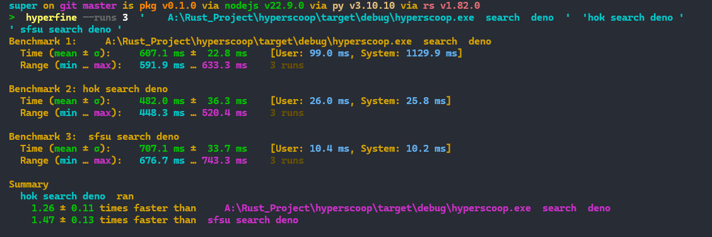

# Changelog

## 1.0.4 (2024-11-10)

- 壮举   : 完成search命令的实现
  

---

## 1.0.3 (2024-11-5)

- 壮举 : 完成List命令
  

## 1.0.2 (2024-11-3)

- 完成bucket命令和merge命令
  

---

## 1.0.1 (2024-10-27)  初始化CLI

### [0.1.0]

    *2024/10/27 初始化hyperscoop和 manifest*

--- 

### [0.1.1]   *2024/10/27 增加了一些功能*  

