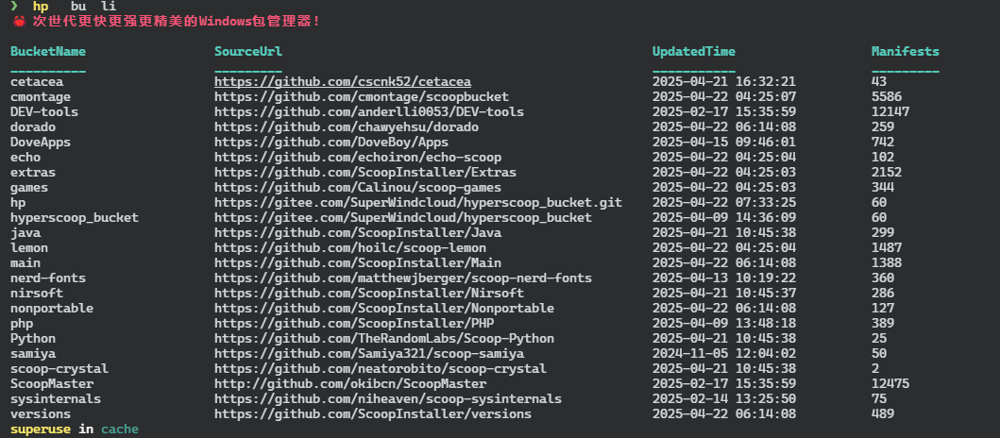

<a href='https://postimg.cc/HVXTGZq6' target='_blank'></a>
> [!IMPORTANT]
> ## Latest Release 请到 [Github](https://github.com/Super1Windcloud/hyperscoop/releases), [English Readme](./README.en.md)

> [!IMPORTANT]
> ## 运行前请关闭国产杀毒软件 ,微软等各种电脑自带的管家(卡巴斯基除外)
------ 

# HYPERSCOOP(hp)

## 🐼 一个更快,更强, 更精美的  windows 包管理器,By Rust( 继承自 scoop )
--- 

## Feature

- > **多进度条, 多线程 , 丰富色彩, 命令识别自动补全 ......**
- > **为Aria2动态选择合适的分片数和并发线程数, 以达到最速下载,拉爆你的带宽**
- > **支持URL直链安装, 无拘无束, 随心所欲 ,肆意驰骋**

## 快速开始,三种方式

### 1. By Scoop

- `scoop bucket add hp https://github.com/Super1Windcloud/hyperscoop_bucket.git`
- `scoop  install  -u  -s   hp/hp`

--- 

### 2. By  Powershell

```powershell
iwr   -useb  https://raw.githubusercontent.com/Super1Windcloud/hyperscoop/refs/heads/main/install.ps1    | iex
```
---
### 3. By Cargo Binstall
```bash
cargo  install  binstall
cargo  binstall  hp2
```

---
### 4. By Cargo
`cargo  install  hp2`


---
### 5. 下载[exe](https://github.com/Super1Windcloud/hyperscoop/releases)使用,并添加到 `$env:Path`

## 使用前提

> `hp b k` 查看官方的bucket列表, `hp b -i` 添加所有bucket ,`hp i 7zip` 用于生命周期脚本 , `hp i aria2` 安装在本地

## Bucket Demo



## 🏗 Project Status   (Completed🍻🎉🐉)

|  |
|:-----------------------------------------------------------:|
|                      Under Maintenance                      |

---

## CLI Features
--- 

<!--  -->
--- 

## ☑️ TODO (功能全部完成, 尽情使用)

- [x]  Alias
- [x] Bucket
- [x] cat
- [x] cache
- [x]  checkup
- [x]  cleanup
- [x]  config
- [x]  export
- [x]  home
- [x]  import
- [x]  info
- [x]  hold
- [x] install
- [x] list
- [x] prefix
- [x] reset
- [x] search
- [x] shim
- [x] status
- [x] uninstall
- [x] update
- [x] which
- [x] merge
- [x] credits

--- 

 

[//]: # ([![sky2.jpg]&#40;https://i.postimg.cc/76yfL7XC/sky2.jpg&#41;]&#40;https://postimg.cc/FfD9WYMm&#41;)

--- 

- 美是一种选择，甚至是一种放弃，而不是贪婪。
- 君子应处木雁之间，当有龙蛇之变

--- 

