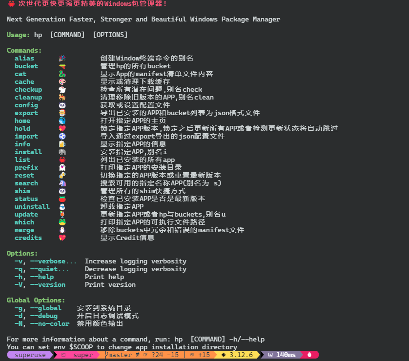

> [!IMPORTANT]  
> ##  Latest Release 请到 [Github](https://github.com/Super1Windcloud/hyperscoop/releases), [English Readme](./README.en.md)

> [!NOTE] 
> ##  已提供upx压缩加壳的exe, 大幅度减少二进制的体积, upx加载存根到内存,绝大部分国产杀软报毒, 见Release 或
`hp i https://github.com/Super1Windcloud/hyperscoop/releases/download/4.0.7/hp_upx.exe -A hpu` 

>[!TIP]
> ##  运行前请关闭国产杀毒软件 ,欧美的卡巴斯基,兰顿什么的除外
------ 
# HYPERSCOOP(hp)

## 🐼 一个更快,更强, 更精美的  windows 包管理器,By Rust( 继承自 scoop )
--- 
## Feature
- >   **多进度条, 多线程  , 丰富色彩, 命令识别自动补全 ......**
- >  **为Aria2动态选择合适的分片数和并发线程数, 以达到最速下载,拉爆你的带宽**
- >  **支持URL直链安装, 无拘无束, 随心所欲 ,肆意驰骋**

## 快速开始,两种方式 
###  1.  By Powershell or cmd 
-  `scoop bucket add hp https://gitee.com/SuperWindcloud/hyperscoop_bucket.git` 
-  `scoop  install  -u  -s   hp/hp`    
--- 
###   2.  下载[exe](https://github.com/Super1Windcloud/hyperscoop/releases)使用,并添加到 `$env:Path`

## 使用前提
>  `hp b k` 查看官方的bucket列表, 'hp b -i' 添加所有bucket ,hp  i  7zip 用于生命周期脚本

## Bucket Demo 

## 🏗 Project Status   (Completed🍻🎉🐉)
|  |
|:-----------------------------------------------------------:|
|                      Under Maintenance                      |
---

## CLI Features
--- 

--- 
## ☑️ TODO (功能全部完成, 尽情使用)
- [x]  Alias
- [x] Bucket
- [x] cat 
- [x] cache 
- [x]  checkup 
- [x]  cleanup  
- [x]  config 
- [x]  export  
- [x]  home 
- [x]  import 
- [x]  info 
- [x]  hold 
- [x] install 
- [x] list 
- [x] prefix 
- [x] reset 
- [x] search 
- [x] shim
- [x] status  
- [x] uninstall  
- [x] update  
- [x] which 
- [x] merge 
- [x] credits

--- 
## 开发计划

- **[ROADMAP](./roadmap.md)** 

[//]: # ([![sky2.jpg]&#40;https://i.postimg.cc/76yfL7XC/sky2.jpg&#41;]&#40;https://postimg.cc/FfD9WYMm&#41;)

--- 
- 美是一种选择，甚至是一种放弃，而不是贪婪。
- 经过人生的荒芜, 才干抵达内心的繁华 
- 君子应处木雁之间，当有龙蛇之变 
--- 

