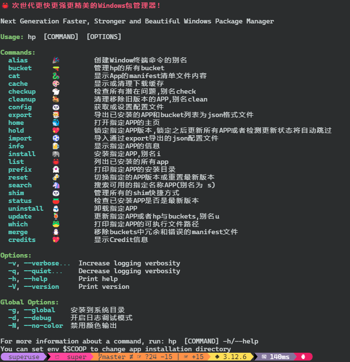

<a href='https://postimg.cc/HVXTGZq6' target='_blank'></a>
> [!IMPORTANT]
> ## Latest Release Please go to [Github](https://github.com/Super1Windcloud/hyperscoop/releases), [English Readme](./README.en.md)

> [!IMPORTANT]
> ## Before running, please close domestic antivirus software, various computer built-in guardians (except Kaspersky)
------

# HYPERSCOOP(hp)

## 🐼 A faster, stronger, and more beautiful Windows package manager, written in Rust (inherited from Scoop)
---

## Features

- > **Multiple progress bars, multi-threading, rich colors, command auto-completion......**
- > **Dynamically select appropriate shards and concurrent threads for Aria2 to achieve maximum download speed, pushing your bandwidth to the limit**
- > **Support direct URL installation, unrestricted, go anywhere you want**

## Quick Start, Three Methods

### 1. By Scoop

- `scoop bucket add hp https://gitee.com/SuperWindcloud/hyperscoop_bucket.git`
- `scoop  install  -u  -s   hp/hp`

---

### 2. By Powershell

```powershell
iwr   -useb  https://raw.githubusercontent.com/Super1Windcloud/hyperscoop/refs/heads/main/install.ps1    | iex
```
---
### 3. By Cargo Binstall
```bash
cargo  install  binstall
cargo  binstall  hp2
```

---
### 4. By Cargo
`cargo  install  hp2`


---
### 5. Download the [exe](https://github.com/Super1Windcloud/hyperscoop/releases) and add it to `$env:Path`

## Prerequisites

> `hp b k` View official bucket list, `hp b -i` Add all buckets, `hp i 7zip` for lifecycle scripts, `hp i aria2` install locally

## Bucket Demo


## 🏗 Project Status (Completed🍻🎉🐉)

|  |
|:-----------------------------------------------------------:|
|                      Under Maintenance                      |

---

## CLI Features
---

<!--  -->
---

## ☑️ TODO (All features completed, use freely)

- [x]  Alias
- [x] Bucket
- [x] cat
- [x] cache
- [x]  checkup
- [x]  cleanup
- [x]  config
- [x]  export
- [x]  home
- [x]  import
- [x]  info
- [x]  hold
- [x] install
- [x] list
- [x] prefix
- [x] reset
- [x] search
- [x] shim
- [x] status
- [x] uninstall
- [x] update
- [x] which
- [x] merge
- [x] credits

---


[//]: # ([![sky2.jpg]&#40;https://i.postimg.cc/76yfL7XC/sky2.jpg&#41;]&#40;https://postimg.cc/FfD9WYMm&#41;)

---

- Beauty is a choice, even a renunciation, rather than greed.
- A gentleman should be flexible like wood and goose, adapting like dragons and snakes.

---