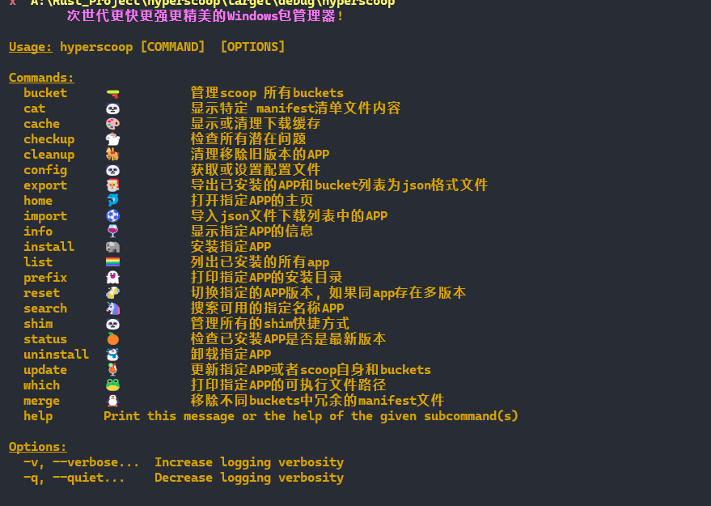
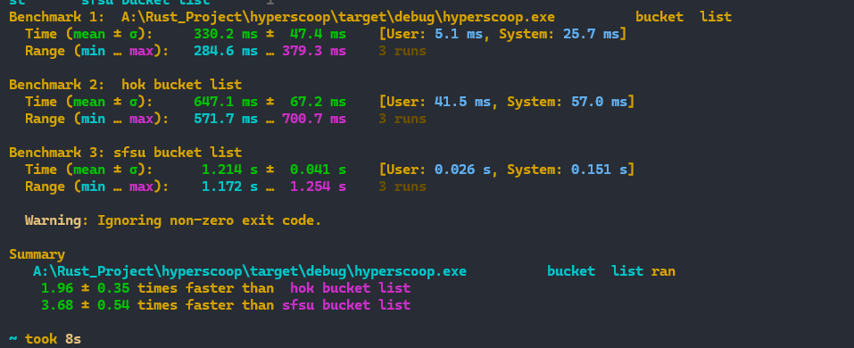

# hyperscoop    (WIP 正在开发中)

## 🐼 一个更快,更强, 更精美的  windows 包管理器基于 rust ( 继承自 scoop )

## 快速开始 [source_bucket]( https://gitee.com/SuperWindcloud/hyperscoop_bucket.git)

```bash
 scoop bucket add hp https://gitee.com/SuperWindcloud/hyperscoop_bucket.git
scoop  install  hp/hyperscoop 
 
```

---

## CLI Features

- 

---

## ToDo  Command 
- [x] Bucket
- [x]  cat 
- [ ] cache 
- [ ]  checkup 
- [ ]  cleanup  
- [ ]  config 
- [ ]  export  
- [x] home 
- [ ] import 
- [x]  info 
- [ ] install 
- [x] list 
- [ ] prefix 
- [ ] reset 
-  [x] search 
- [ ] shim
- [ ]  status  
- [ ]  uninstall  
- [ ]  update  
- [ ]  which 
- [x] merge 
## benchmark

- 

---

- 

---

- 

## 开发计划

- **[roadmap](./roadmap.md)** 
