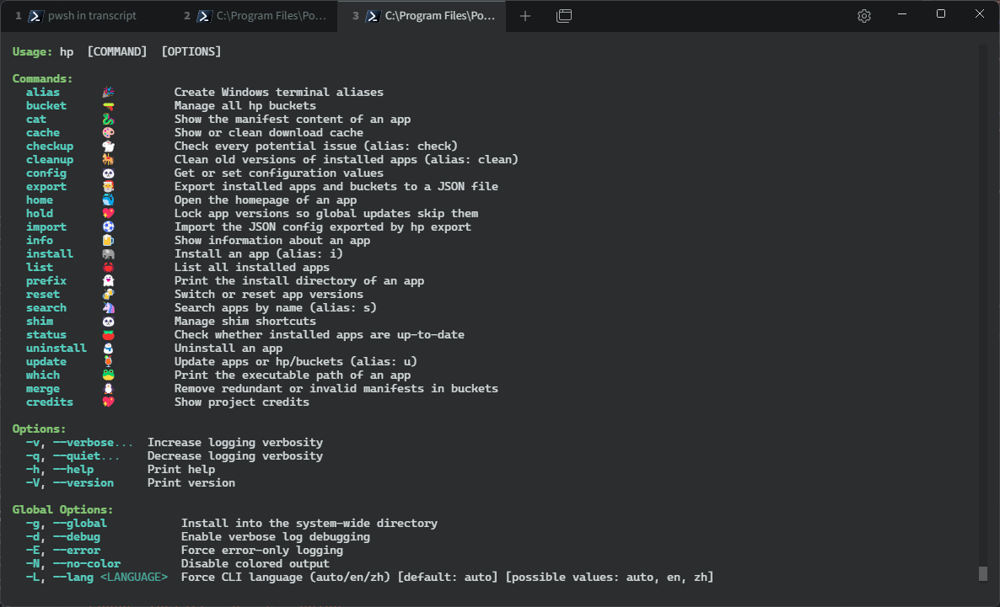
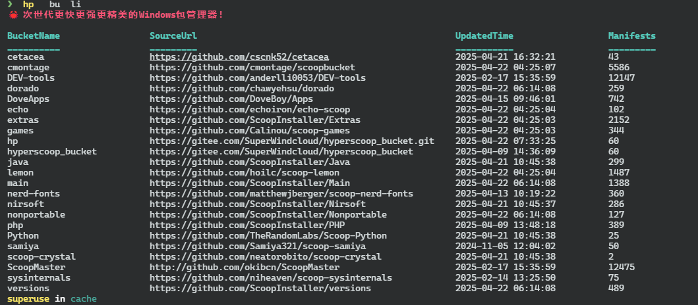

<!-- HYPERSCOOP README.md -->
<p align="center">
  
</p>

<h1 align="center">✨ HYPERSCOOP (hp)</h1>

<p align="center">
  🐼 <b>A faster, stronger, and more beautiful Windows package manager written in Rust</b><br>
  <em>Inherited from Scoop — reborn with power and style.</em>
</p>

<p align="center">
  <a href="https://github.com/Super1Windcloud/hyperscoop/releases">
    
  </a>
  <a href="./README.ch.md">
    
  </a>
  
  
  
</p>

<hr style="border: 0; height: 2px; background: linear-gradient(to right, #ff99cc, #66ccff);" />

> [!IMPORTANT]
> ⚠️ **Before running:** Please close domestic antivirus software and built-in system guardians (except Kaspersky)

---

## 🚀 Quick Start

### 🧩 Via Scoop

```powershell
scoop bucket add hp https://github.com/Super1Windcloud/hyperscoop_source_bucket.git
scoop install -u -s hp/hp
```

### 🧩 Via PowerShell Script

```powershell
irm -useb https://raw.githubusercontent.com/Super1Windcloud/hyperscoop/refs/heads/main/install.ps1 | iex
```

### 🧩 Via Cargo (Git)

```bash
cargo install --git https://github.com/super1windcloud/hyperscoop
```

### 🧩 Manual Installation

[⬇️ Download the EXE](https://github.com/Super1Windcloud/hyperscoop/releases)  
and add it to your `$env:Path`.

---

## 💎 Features at a Glance

| 🌟 Feature               | ⚙️ Description                                             |
|--------------------------|------------------------------------------------------------|
| 🎨 **Beautiful CLI**     | Multi-threaded progress bars, rich colors, auto-completion |
| ⚡ **Adaptive Speed**     | Dynamically optimizes Aria2 shards & threads               |
| 🌐 **Bilingual (i18n)** | Native English and Chinese support with seamless switching |
| 🌍 **Freedom Mode**      | Supports direct URL installation, no region restrictions   |
| 🧩 **Smart Buckets**     | `hp b k` to view, `hp i aria2` to install dependencies     |
| 💾 **Lifecycle Scripts** | Full scoop lifecycle integration                           |
| 🧠 **Rust-Powered Core** | Fast, safe, and reliable under the hood                    |

---

## 🏗️ Project Status

<p align="center">
  <br>
  <b>✅ Under Active Maintenance</b>
</p>

---

## 🧰 CLI Preview

<p align="center">
  
</p>

---

## ✅ Completed Features

| Command               | Description                     |
|-----------------------|---------------------------------|
| ✅ alias               | Manage command aliases          |
| ✅ autoremove          | Clean up unused packages installed as dependencies |
| ✅ bucket              | Add / remove / list buckets     |
| ✅ bundle              | Declarative environment management via Hpfile (dump / install / check / cleanup) |
| ✅ cache               | Manage download cache           |
| ✅ checkup / doctor    | Scan and diagnose system issues (PATH, antivirus, broken junctions, invalid shims) |
| ✅ cleanup             | Clean unused files and cache (supports `--dry-run` / `-n`) |
| ✅ completion          | Generate shell completion scripts |
| ✅ config              | Configure hp settings           |
| ✅ deps                | Query dependencies and tree for an application |
| ✅ desc                | Show package description or search across descriptions |
| ✅ edit                | Open app manifest directly in default or configured editor |
| ✅ export / import     | Backup and restore configs      |
| ✅ fetch / download    | Download app package(s) into cache without installing |
| ✅ hold / pin          | Lock apps to prevent updates    |
| ✅ unpin / unhold      | Unlock apps to allow updates    |
| ✅ install / uninstall | Full package lifecycle with `--dry-run` and dependency safety protection |
| ✅ leaves              | List top-level installed applications (not required by others) |
| ✅ link / unlink       | Link or unlink app shims and shortcuts without uninstalling |
| ✅ log                 | View git commit history of an app manifest |
| ✅ missing             | Verify dependency integrity and report missing requirements |
| ✅ reinstall / re      | Reinstall one or more applications |
| ✅ service / services  | Background service management (list, status, start, stop, restart) |
| ✅ shellenv            | Output shell environment configuration (PowerShell, CMD, Bash, Zsh, Nu) |
| ✅ size / disk-usage   | Analyze disk space usage for apps, cache, and persist data |
| ✅ status / outdated   | Check whether installed apps need updates |
| ✅ switch              | Switch active version of an installed app or list versions |
| ✅ update / upgrade    | Update single or all apps (supports `--cleanup` / `-c` and auto-cleanup) |
| ✅ uses                | Query packages that depend on an app (reverse dependencies) |
| ✅ which               | Locate installed binaries       |
| ✅ merge               | Combine configurations          |
| ✅ credits             | Show project credits            |

---

## 📦 Bucket Demo

<p align="center">
  
</p>

---

## 🌈 Philosophy

> “Beauty is a choice — a kind of restraint, not greed.”  
> “A gentleman should be flexible like wood and goose, adapting like dragons and snakes.”

<p align="center">
  
  

</p>

---

## 💖 Support & Contribute

- ⭐ Star this repo if you like it
- 🧩 Submit PRs or issues on [GitHub](https://github.com/Super1Windcloud/hyperscoop/issues)

---

<p align="center">
  
</p>


